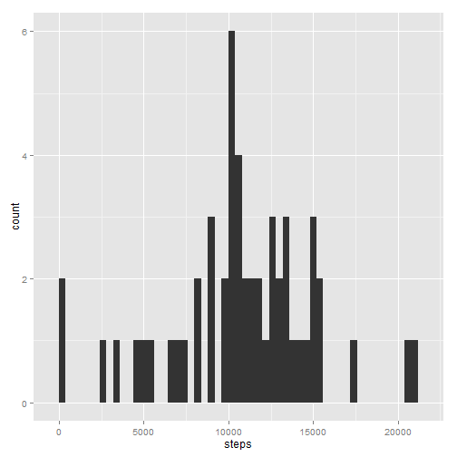
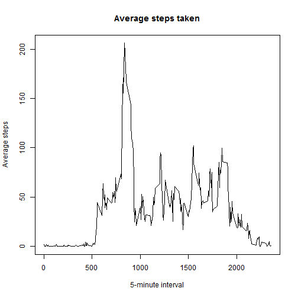
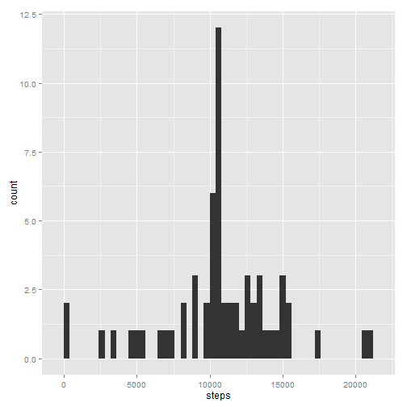
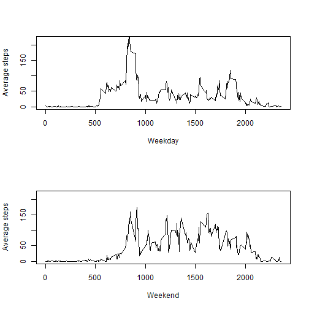

This is a Coursera reproducible course project. The task is to explore the statistics and patterns of the 5 minute steps taken each day, imputed the missing values for steps and exploring activity patterns for interval and during weekday and weekend.  

## Loading and preprocessing the data

Assume the data is unzipped and located in the current working directory. The following codes are used to load.


```r
# check work directory
if(!getwd()=="C:/Users/song/Dropbox/Coursera/reproduce")
  setwd("C:/Users/song/Dropbox/Coursera/reproduce")

#read data in 
 datains <- read.csv('activity.csv',na='NA')
```

The folowing steps is to process the data, main task is to change interval to time format and combine with date to make a date format variable. 


```r
#convert interval to time format
timeday <- strptime(sprintf("%04d", as.numeric(as.character(datains$interval))), "%H%M")
timedayf <- data.frame(timeday)
#remove added date part 
timedayf <- gsub('2014-07-19','',timedayf$timeday)
#add in time to data frame
datetime<- cbind(datains,timedayf)

#convert datetime to date format
comb <- data.frame(daytime=paste(as.character(datetime$date),as.character(datetime$timedayf)))
comb$daytime <- as.POSIXlt(as.character(comb$daytime))

#combine steps information with converted datetime
steptime <- cbind(datetime,comb)
```

The date frame steptime is the processed dataset and is ready for analysis.


## What is mean total number of steps taken per day?

In this task,the total number of steps, mean and median of total numbers taken each is calculated after ignoring the missing values.  A histogram is also plotted. 


```r
#1, remove NA for steps
stepdatetime <- steptime[!is.na(steptime$steps),]
stepdatetime$steps <- as.numeric(stepdatetime$steps)

#get total steps by date
sum_in <- aggregate(steps~date,stepdatetime,sum)

#plot histogram 
library(ggplot2)
ggplot(sum_in, aes(x=steps)) + geom_histogram(binwidth=400)
```

 

Mean and median of steps taken


```r
#mean of steps taken
mean(sum_in$steps)
```

```
## [1] 10766
```

```r
#median of steps taken
median(sum_in$steps)
```

```
## [1] 10765
```


## What is the average daily activity pattern?

This task requires calculate the average steps of the 5-minute interval across all days, plot the time series graph and figure out the interval in which the maxium number of steps was taken. 

The results can be seen here:


```r
#get mean steps for each interval
mean_int <- aggregate(steps~interval,stepdatetime,mean)

#time series plot
plot(mean_int$interval,mean_int$steps,type='l',main='Average steps taken',xlab='5-minute interval',ylab='Average steps')
```

 


```r
#sort steps in descending order to get the max steps interval
interval_max <- mean_int[with(mean_int, order(-steps)),]

#output the first row to the interval which max average steps were taken
head(interval_max ,1)
```

```
##     interval steps
## 104      835 206.2
```

As result shown above, the max steps(206 steps) was taken on interval 835.

## Imputing missing values

This task is to figure out the number of missing values and impute them using mean steps of 5-minute interval.  

First, the total number of missing values can be seen as:


```r
nastep <-steptime[is.na(steptime$steps),]
nrow(nastep)
```

```
## [1] 2304
```

Second, impute missing values using calculated mean for that 5-minute interval and create a new dataset,imputedata, with missing data filled in.


```r
#impute NA by merge in mean steps of that day
impute <- merge(steptime[,c('steps','date','interval','daytime')],mean_int,by.x='interval',by.y='interval',all=T)

impute$steps.x <- ifelse(is.na(impute$steps.x),impute$steps.y,impute$steps.x) 
#rename steps.x to steps

colnames(impute)[2] <- "steps" 

#sort data
imputedata <- impute[with(impute, order(date,interval)),c('steps','date','interval','daytime')]
```

The following shows the data contenst for first 5 rows before and after imputation.


```r
# first 5 rows of data before imputation.
head(steptime[c('steps','date','interval','daytime')],5,row.names=F)
```

```
##   steps       date interval             daytime
## 1    NA 2012-10-01        0 2012-10-01 00:00:00
## 2    NA 2012-10-01        5 2012-10-01 00:05:00
## 3    NA 2012-10-01       10 2012-10-01 00:10:00
## 4    NA 2012-10-01       15 2012-10-01 00:15:00
## 5    NA 2012-10-01       20 2012-10-01 00:20:00
```


```r
# first 5 rows of data after imputation.
head(imputedata[c('steps','date','interval','daytime')],5,row.names=F)
```

```
##       steps       date interval             daytime
## 1   1.71698 2012-10-01        0 2012-10-01 00:00:00
## 63  0.33962 2012-10-01        5 2012-10-01 00:05:00
## 128 0.13208 2012-10-01       10 2012-10-01 00:10:00
## 205 0.15094 2012-10-01       15 2012-10-01 00:15:00
## 264 0.07547 2012-10-01       20 2012-10-01 00:20:00
```

The total steps caclulation and histogram using filled in values can be seen as:
 

```r
#get total steps per day using imputed data
sumimpute <- aggregate(steps~date,imputedata,sum)

#redo histogram after filled in NA values
library(ggplot2)
ggplot(sumimpute, aes(x=steps)) + geom_histogram(binwidth=400)
```

 

Here are the mean and median steps taken summary after missing values imputation:


```r
#output mean and median of steps taken after imputation
mean(sumimpute$steps)
```

```
## [1] 10766
```

```r
median(sumimpute$steps)
```

```
## [1] 10766
```

As you can see, that the mean of steps taken doesn't change while median steps changes a lit bit after filling in. Using mean steps of each interval to impute missing values doesn't seem to affect the estimates of the total daily number of steps. However, other imputation strategy might have impact on the estimation.

## Are there differences in activity patterns between weekdays and weekends?

In this task, a new variable weekday is created with "weekday" and "weekend" two levels. A panel plot is created based on filled in datasets to show the difference in activity patterns between weekday and weekend. 


```r
#check weekend and weekday
week <- data.frame(weekname=weekdays(imputedata$daytime))
weekd <- cbind(steptime,week)

#create weekend and weekday 
stepweek <-data.frame(weekdaylevel=ifelse(weekd$weekname %in% c('Saturday','Sunday'),'weekend','weekday'))

#create analytic data with steps, date, time, weekday 
stepweekday<- cbind(weekd,stepweek)
```

Here is the data with newly created factor for weekday and weekend.


```r
#show partial data
head(stepweekday[1:5,c('steps','daytime','weekdaylevel')],row.names=F)
```

```
##   steps             daytime weekdaylevel
## 1    NA 2012-10-01 00:00:00      weekday
## 2    NA 2012-10-01 00:05:00      weekday
## 3    NA 2012-10-01 00:10:00      weekday
## 4    NA 2012-10-01 00:15:00      weekday
## 5    NA 2012-10-01 00:20:00      weekday
```

The statistics and plots using weekdaylevel as factor are: 


```r
#calculate mean steps taken by interval during weekday
weekave <- aggregate(steps~interval,stepweekday[stepweekday$weekdaylevel=='weekday',],mean)
#calculate mean steps taken by interval during weekend
weekendave <- aggregate(steps~interval,stepweekday[stepweekday$weekdaylevel=='weekend',],mean)

#panel plots using basic R
par(mfrow=c(2,1))

plot(weekave$interval,weekave$steps,type='l',xlab='Weekday',
     ylab='Average steps',ylim=range(0:220))

plot(weekendave$interval,weekendave$steps,type='l',xlab='Weekend',ylab='Average steps',ylim=range(0:220))
```

 

As shown above, there are difference activity pattern during weekday and weekend.
* Steps taken starts earlier and increase higher on weekday morning than on weekend
* There are more steps taken during afternoon in weeekend than in weekday.
* At night time steps taken decrease ealier than during weekday than in weekend.
